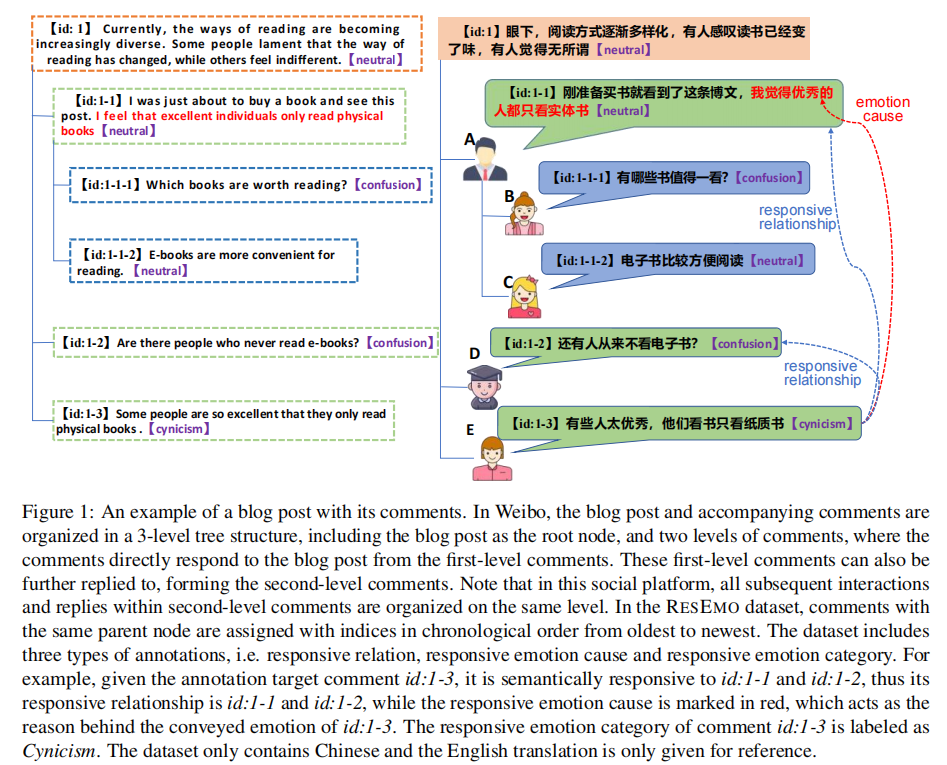
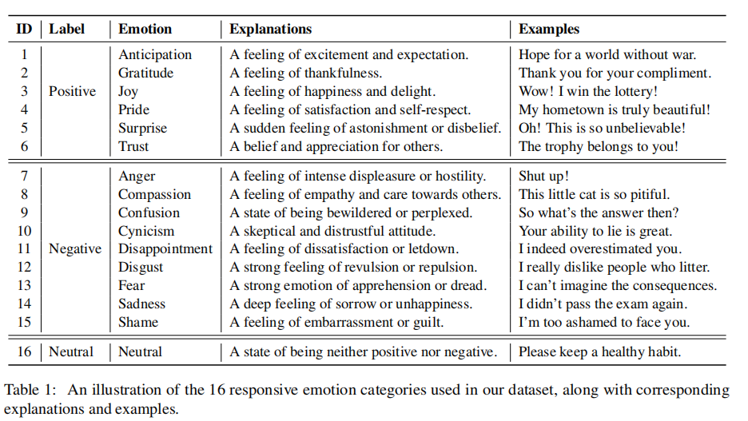

# RESEMO: A Benchmark Chinese Dataset for Studying Responsive Emotion from Social Media Content

🔥**Note**: If you need to use our dataset, please send an email to zhangm@mail.ustc.edu.cn to obtain it.

## Dataset: RESEMO

- **Overview**:  
we propose a Chinese dataset named RESEMO for responsive emotion analysis, including 3813 posts with 68,781 comments collected from Weibo, the largest social media platform in China. RESEMO contains three types of human annotations with
respect to responsive emotions, namely, responsive relationship, responsive emotion cause, and responsive emotion category.
- **Emotional category**:  
Our dataset is annotated with 16 emotion categories, including 6 positive emotions, 9 negative emotions, and 1 neutral emotion. The details are shown in the following table:

